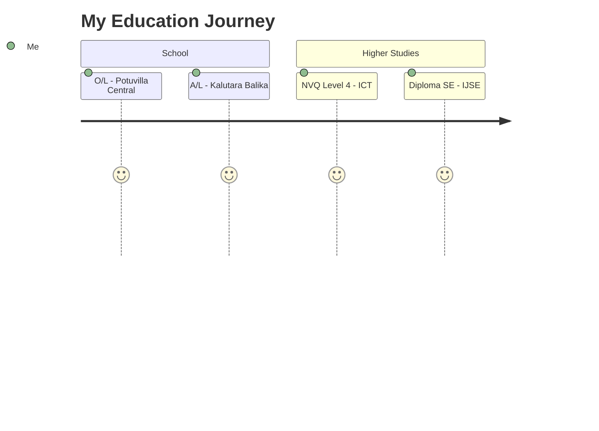

<div align="center">
  
</div>

<div align="center">
  
  

  <br/>

  

  <p>
    <a href="https://www.linkedin.com/in/nipuni-nilsha-0373443b7/"></a>
    <a href="mailto:nipuni.munasinghe101@gmail.com"></a>
    <a href="https://nipuninilsha.github.io/My-Portfolio/"></a>
    <a href="https://www.instagram.com/___nipuninilsha___/"></a>
  </p>

  <p>
    
    
  </p>
</div>


##  About Me

<div align="center">
<table border="0">
<tr>
<td width="50%" valign="top">

```javascript
const nipuni = {
    pronouns: "she/her",
    location: "Sri Lanka 🇱🇰",
    role: "Web Developer & UI/UX Designer",
    education: "Software Engineering @ IJSE",
    
    code: ["JavaScript", "Java", "Python"],
    design: ["Figma", "Adobe XD", "UI/UX"],
    tools: ["VS Code", "IntelliJ", "Git"],
    
    currentFocus: "Building aesthetic & functional web apps",
    lifePhilosophy: "Design with heart, code with mind ✨"
}
```

<br/>

**🌸 Fun Facts About Me:**

- 🎨 I believe good design tells a story
- ☕ Fueled by coffee and creativity
- 📸 Photography enthusiast in my free time
- 💡 I turn Figma dreams into reality
- 🌱 Always learning something new!

</td>
<td width="50%" align="center">


</td>
</tr>
</table>
</div>

---

##  What I'm Up To

<div align="center">

| | Activity |
|---|---|
| 🎓 | Studying **Diploma in Software Engineering** @ IJSE |
| 💻 | Building responsive websites with **HTML, CSS, JS & Java** |
| 🎨 | Crafting UI/UX designs in **Figma** that users love |
| ☕ | Developing desktop apps using **JavaFX + MySQL** |
| 📚 | Exploring **OOP, Data Structures & Design Patterns** |
| 🚀 | Working on **POS System** & **Stock Management** projects |

</div>

---

##  Tech Arsenal

<div align="center">

### 👩‍💻 Languages
<p>
  <a href="#"></a>
</p>

### 🎨 Design & Frontend
<p>
  
  
  
  
  
  
  
</p>

### ⚙️ Backend & Database
<p>
  
  
  
</p>

### 🛠️ Tools I Love
<p>
  <a href="#"></a>
</p>

<br/>


</div>

---

##  Featured Projects

<div align="center">

<table>
<tr>
<td width="33%" align="center">

### 📦 Stock Management


**Java | File I/O | CLI**  
Smart inventory system with real-time tracking

<br/>

[](https://github.com/nipuninilsha)

</td>
<td width="33%" align="center">

### 🔴 Connect Four AI


**Java | Minimax | OOP**  
Classic game with intelligent AI opponent

<br/>

[](https://github.com/nipuninilsha)

</td>
<td width="33%" align="center">

### 🛒 POS System


**JavaFX | MySQL | MVC**  
Complete retail solution with CRM

<br/>

[](https://github.com/nipuninilsha)

</td>
</tr>
</table>

</div>

---

## 📊 GitHub Magic

<div align="center">


<br/><br/>


<br/><br/>


<br/><br/>


</div>

---

## 🎓 Education Journey

<div align="center">



| 🏫 Institute | 📚 Program | 📅 Year |
| :--- | :--- | :---: |
| 💻 IJSE | Diploma in Software Engineering | 2024-Present |
| 🖥️ NVQ | Level 4 - Information & Communication Technology | 2024 |
| 🏫 Kalutara Balika Vidyalaya | G.C.E. Advanced Level - Arts | 2022 |
| 🏫 Potuvilla Central College | G.C.E. Ordinary Level | 2019 |

</div>

---

## 💌 Let's Connect & Create Something Amazing!

<div align="center">

 <br/>

**I'm always open to collaborating on interesting projects!**

<br/>

<a href="https://www.linkedin.com/in/nipuni-nilsha-0373443b7/">
  
</a>
<a href="mailto:nipuni.munasinghe101@gmail.com">
  
</a>
<a href="https://nipuninilsha.github.io/My-Portfolio/">
  
</a>

<br/><br/>


### 💖 Thanks for visiting! 

<p>
  
</p>

> *"Good design is invisible — good code makes it real. I do both! ✨"*

<br/>


</div>

<div align="center">
  
</div>

<!-- 
  ✨ Pro Tip: Add this snake animation after enabling GitHub Actions!
  https://github.com/nipuninilsha/nipuninilsha/blob/output/github-contribution-grid-snake.svg
  
-->
